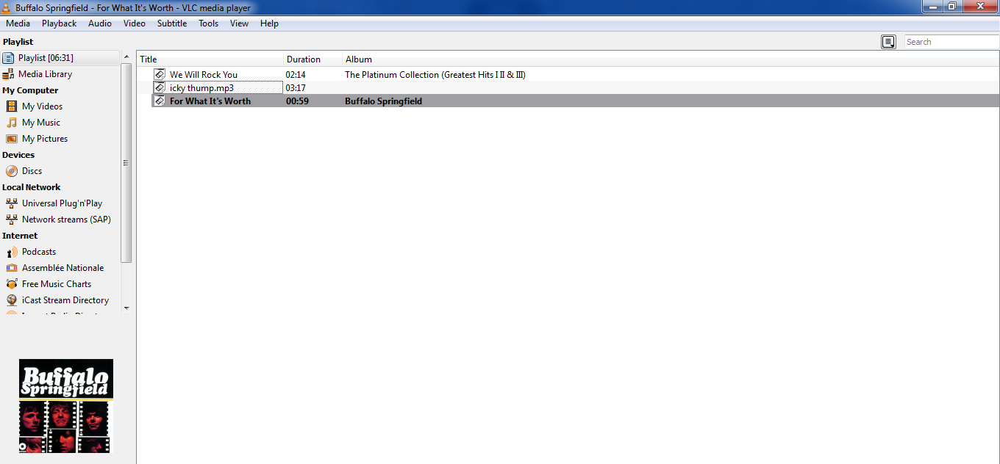

# Downloader
Convert youtube videos into mp3 and download it in your pc,  Optional-Download any APK Too

#How to run
 run the script -- python songs-apk.py
 
 Enter the song or video name it'll be download in your PC
#Requirement
  Python
  
  requests
 
  BeautifulSoup
  
  urllib2
  
  
  

Using this script you can also create online portal for converting any video into mp3

Check this out simple demo that I've created using this script

#http://songsapk.esy.es/main.html

#Don't judge me this is just a demo(and its only for song i haven't add function of apk-download yet!!)
